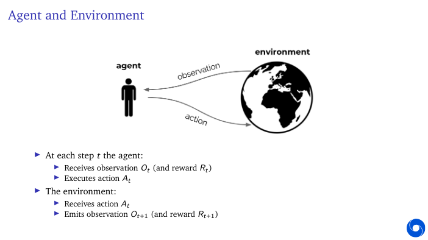
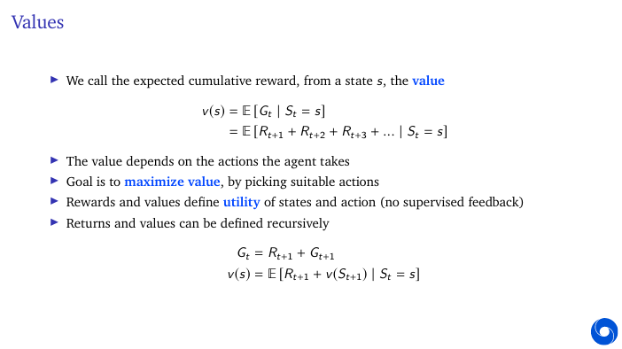
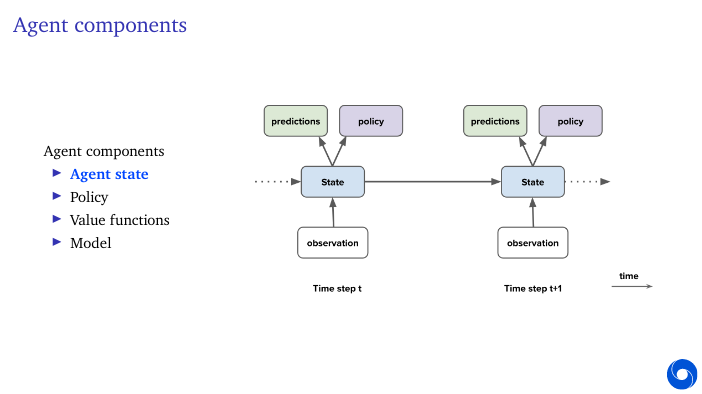
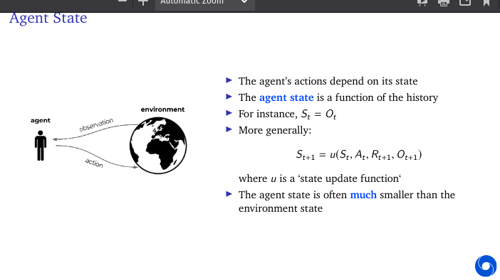
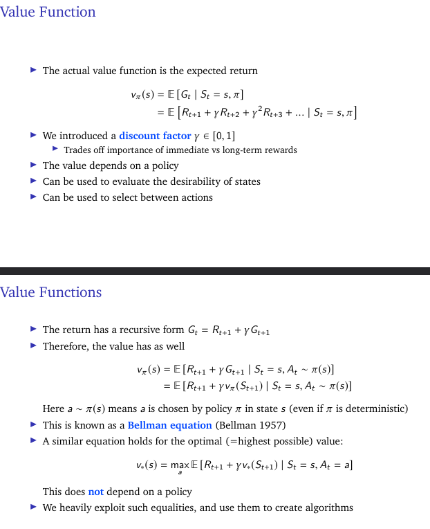
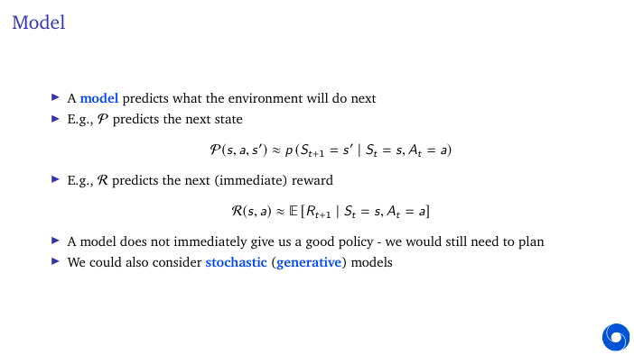

**AI** - allow machines to find solutions themselves.

- can machines think

What is artificial intelligence?

- To be able to learn to make decisions to achieve goals

without examples of optimal behaviour here means that whithout an exact example

Agent acting with the environment and environment observing it.

Much more natural to think the rewartd to be internal to the agent. Preference function to these observatons. And optimises itself to get more rewards.

RL is based on **reward hypothesis** 

*Any goal can be formalized as the outcome of maximisizing a cumulative reward. can be -1, 0, 1 for eg* 

What is Reinforcement learning?

1. Find **solutions**
   - A program that plays chess really well
2. **adapt online**, deal with unforeseen circumstances
    - A chess program that can learn to adapt to you.

Science and framework of **Learning to make decision from interaction**

- at time t agents gets observation does action and observer recives action and makes observation for t+1

A **Reward** is a scalar feedback signal.

return - cumulative reward for the future rewards

Value is the expected cumulative reward 
Maximising value by taking actions. Reward may be delayed but actions may have long term consequences.

Action values exist (Lec 3,4,5,6)

## Core concepts

The reinforcement learning formalism includes
- **Environment** (dynamics of the problem)
- **Reward** signal (specifies the goal)
- **Agent**, containing:
  - Agent state
  - Policy
  - Value function estimate?
  - Model?
- We will now go into the agent

Agent state - what u take from time t to time t+1 

The **Environment state** is the environment's internal state, invisible to the agent

**History** is the full sequence of observations, actions, rewards. Used to construct agent state.

**Markov deciison process** 
State contains all we need to know from the history. And adding more history idoesn't help. Once state is known, history may be thrown away. Typically agent state is some compression of *H*

*S* to denote the agent state not the environment state.

**Partially observable Environments** Not markovian eg A robot with camera vision doesnt know its absolute location.

agent state is function of history 

## Partially Observable Environments

- To deal with partial observability, agent can construct suitable state representations
- Examples of agent states:
  - Last observation: St =Ot (might not be enough)
  - Complete history: St =Ht (might be too large)
  - A generic update: St =u(St−1,At−1,Rt ,Ot )(but how to pick/learn u?)
- Constructing a fully Markovian agent state is often not feasible
- More importantly, the state should allow good policies and value predictions
 
**Policy** defines the agents behavior. it denotes probability of action given a state.

For **value** function, we add a discount factor which is b/w 0 and 1

**Bellman equation** Not depend on policy only on state. R is reward.

A model predicts what the environment will do next

- Value Based
  - No Policy (Implicit)
  - Value Function
- Policy Based
  - Policy
  - No Value Function
- Actor Critic
   - Policy
   - Value Function

- **Prediction**: evaluate the future (for a given policy)
- **Control**: optimise the future (find the best policy)
- These can be strongly related: π∗(s )=argmaxπvπ(s )
- If we could predict everything do we need anything else?
 
## Learning and planning

Two fundamental problems in reinforcement learning
- Learning:
  - The environment is initially unknown
  - The agent interacts with the environment
- Planning:
  - A model of the environment is given (or learnt)
  - The agent plans in this model (without external interaction)
- a.k.a. reasoning, pondering, thought, search, planning
 (Examples)
 
 - In this course, we discuss how to learn by interaction
- focus is on understanding core principles and learning algorithms
- Topics include
  - **Exploration**, in bandits and in sequential problems
  - **Markov decision processes**, and planning by dynamic programming
  - **Model-free prediction and control** (e.g., Q-learning)- Policy-gradient methods
  - **Deep reinforcement learning**
  - **Integrating learning and plannin**