# MDPs And Dynamic Programming

Last lecture: multiple actions, but only one state—no model

This lecture: For now, assume the environment is fully observable, the current observation contains all relevant information.

We will discuss a mathematical formulation of the agent-environment interaction

This is called a **Markov Decision Process (MDP)**

Enables us to talk clearly about the objective and how to achieve it

- Note: Almost all RL problems can be formalised as MDPs, e.g.,
- Optimal control primarily deals with continuous MDPs
- Partially observable problems can be converted into MDPs
- Bandits are MDPs with one state

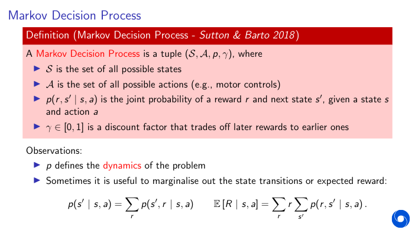

- p is dynamics or transistion dynamics

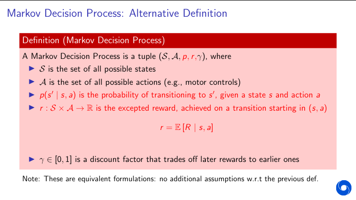

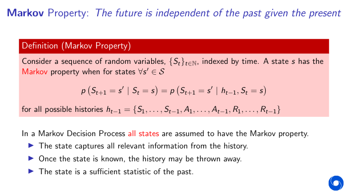

- once state is known, history is no longer needed
- state is sufficient statistics of the past
- Anything that has happened in interaction process is summarised in terms of its information about future observations in its current state

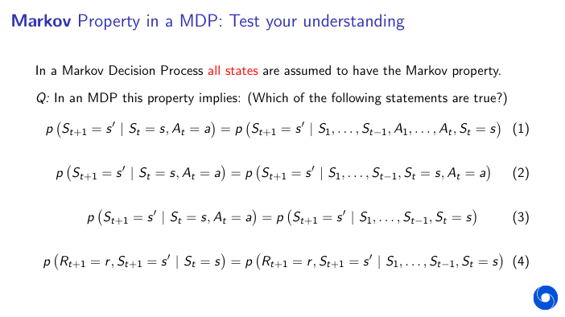
- 1,2,4 are true

- MDP is a tuple of state, action, joint probability, and discount.

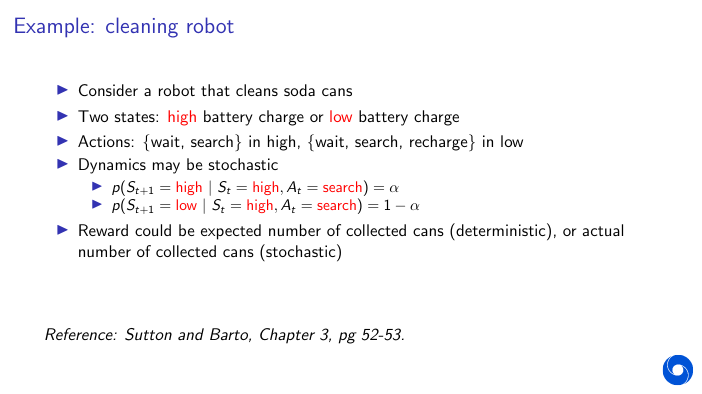

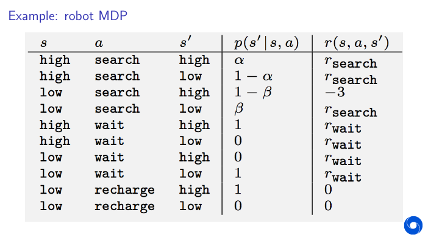

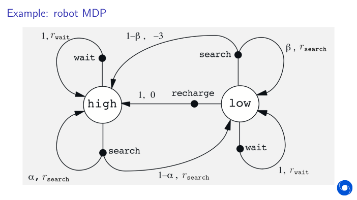

## Returns

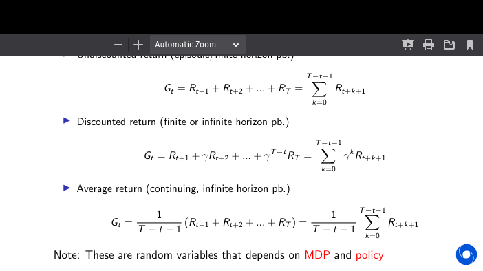

3 types of returns

- Undiscounted return -> Sum of all the returns (D.F = 1)
- Discounted return -> Sum of all the returns taking discount factor into account
- Discounted return is the mostly used and can be used for both finite and infinite horizon problems.
- Average return -> Average of returns
- They are random variables that depend on both MDP and policy.

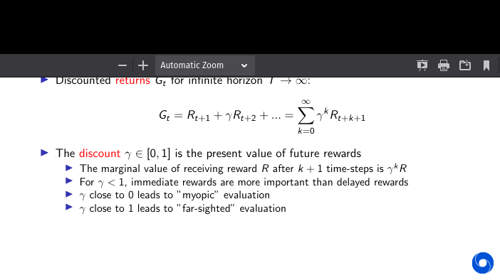

- gamma close to 0 leads to myopic evaluation or most returns is the immediate reward
- gamma close to 1 leads to far-sighted evaluation or it weights all rewards equally for the future.

### Why Discount?

Most Markov decision processes are discounted. Why?

- Problem specification:
    - Immediate rewards may actually be more valuable (e.g., consider earning interest)
    - Animal/human behaviour shows preference for immediate reward
- Solution side:
    - Mathematically convenient to discount rewards
    - Avoids infinite returns in cyclic Markov processes
- The way to think about it: reward and discount together determine the goal

## Policies

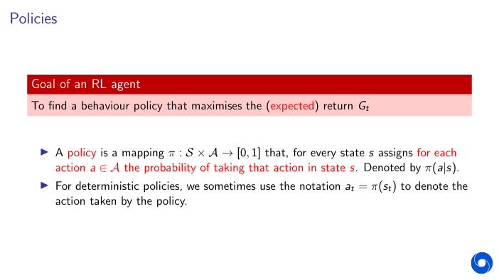

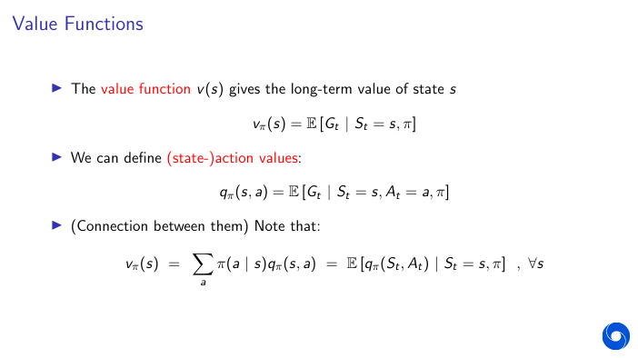
- Value function is the expected state action value under the policy we are evaluating.
  
### Optimal Value Function

- The optimal state-value function v ∗(s ) is the maximum value function over all policies
- The optimal action-value function q∗(s ,a) is the maximum action-value function over
all policies
- The optimal value function specifies the best possible performance in the **MDP**
- An MDP is “solved” when we know the optimal value function

### Optimal Policy 
A policy defines the learning agent's way of behaving at a given time.

Optimal Policy - Define a partial ordering over policies such that Policy p- dominates pi' if every value associated with that state is greater than value associated by policy pi'

Theorem: 

For any MDP:
- There exists an optimal policy π∗ that is better than or equal to all other policies,
π∗ ≥π,∀π
(There can be more than one such optimal policy.)
- All optimal policies achieve the optimal value function, v π∗
(s ) = v ∗(s )
- All optimal policies achieve the optimal action-value function, qπ∗
(s ,a) = q∗(s ,a)

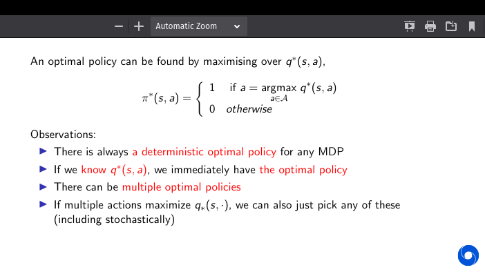

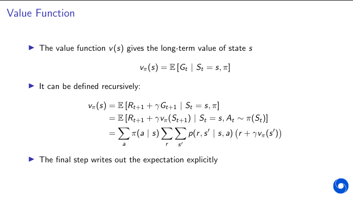

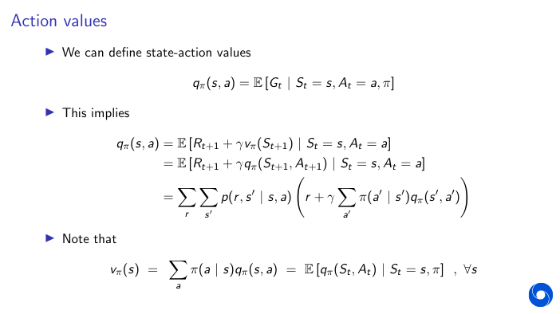

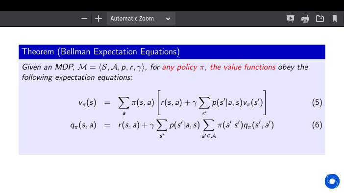

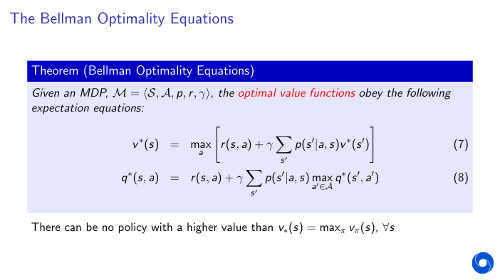

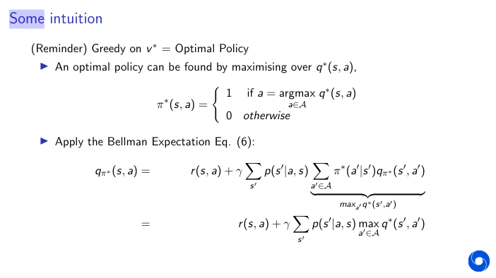

### Problems in RL

Problem 1: Estimating vπ or qπ is called policy evaluation or, simply, prediction

- Given a policy, what is my expected return under that behaviour?
- Given this treatment protocol/trading strategy, what is my expected return?

Problem 2: Estimating v∗ or q∗ is sometimes called control, because these can be used
for policy optimisation
- What is the optimal way of behaving? What is the optimal value function?
- What is the optimal treatment? What is the optimal control policy to minimise
time, fuel consumption, etc

### Exercise 

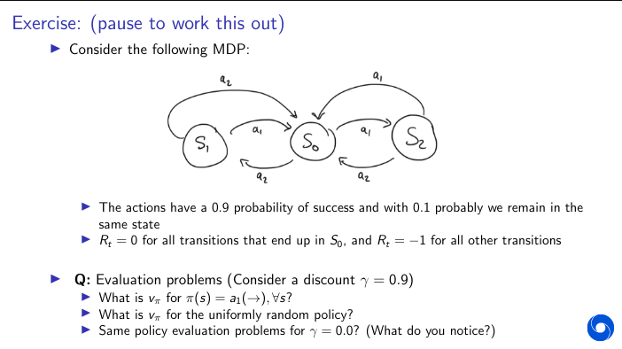

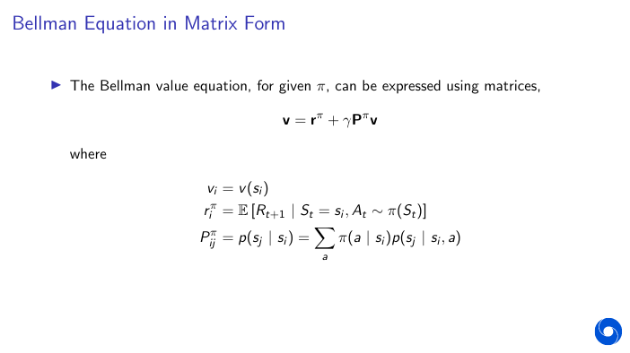

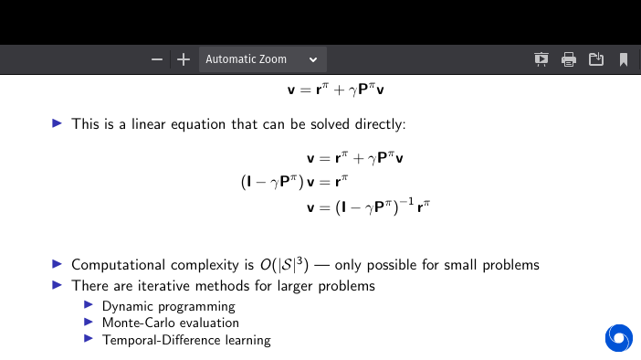

Computational complexity is O (|S|3) — only possible for small problems

- There are iterative methods for larger problems
- Dynamic programming
- Monte-Carlo evaluation
- Temporal-Difference learning

### Solving Bellman Optimality Equation

- The Bellman optimality equation is non-linear
- Cannot use the same direct matrix solution as for policy optimisation (in general)

- Many iterative solution methods:
    - Using models / dynamic programming
        - Value iteration
        - Policy iteration
    - Using samples
        - Monte Carlo
        - Q-learning
        - Sarsa

## Dynamic Programming

Dynamic Programming refers to the class of methods that try to learn the optimal behavior of the optimal value function give a true model of the world and the true model of the MDP.

Sutto And Barto definition - *Dynamic programming refers to a collection of algorithms that can be used
to compute optimal policies given a perfect model of the environment as a
Markov decision process (MDP).*

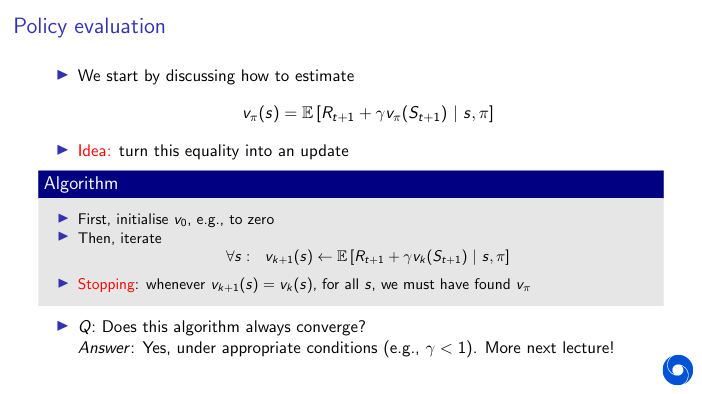

- We stop when Vk and Vk+1 are the same 

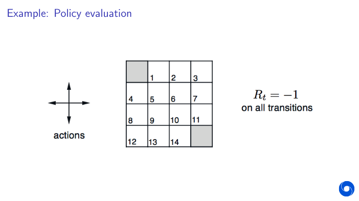

- the grey boxes are termination states. Here Discount factor is 1.0 

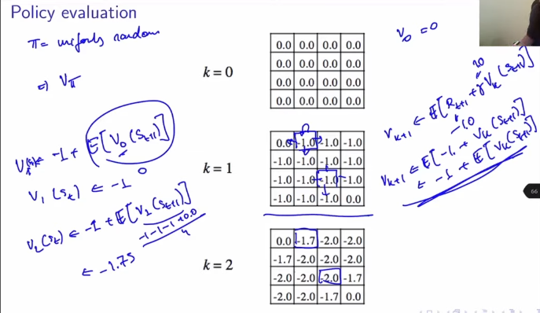

- Value of 1 state is average of neighbouring states. for k = 2, 2nd term would be 0-1-1-1/4

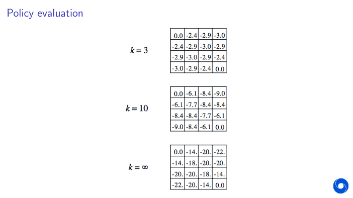

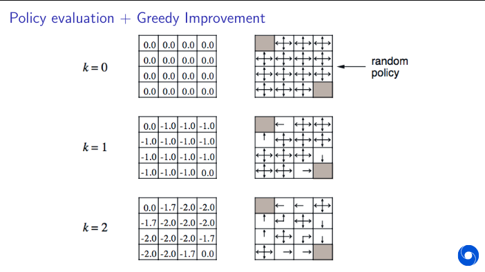

- If we act greediy we can get pretty good/ Optimal policy. 

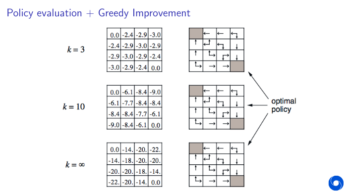

- The example already shows we can use evaluation to then improve our policy
- n fact, just being greedy with respect to the values of the random policy sufficed!
- Claim: One can show that vπnew(s)≥vπ(s), for all s

## Policy Iteration

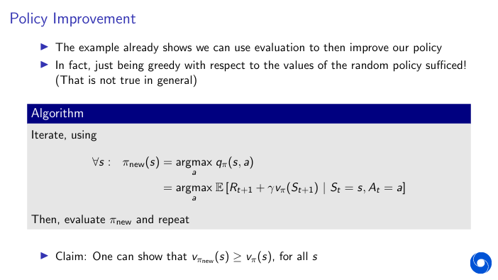

- notes from StackOver
- Basically we take a policy evaluation step, then we take a greedy/improvement step to get a new policy

- Does policy evaluation need to converge to v(pi) ? because there can be many optimal policy
- Or should we stop when we are ‘close’ ?
    - (E.g., with a threshold on the change to the values)
    - Or simply stop after k iterations of iterative policy evaluation?
    - In the small gridworld k = 3 was sufficient to achieve optimal policy
- Extreme: Why not update policy every iteration — i.e. stop after k = 1?
    - This is equivalent to **value iteration**

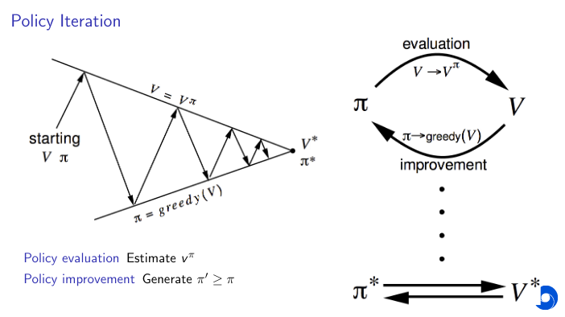

## Value Iteration

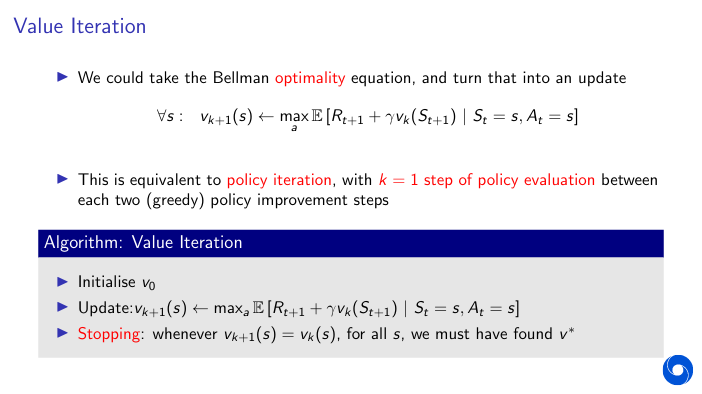
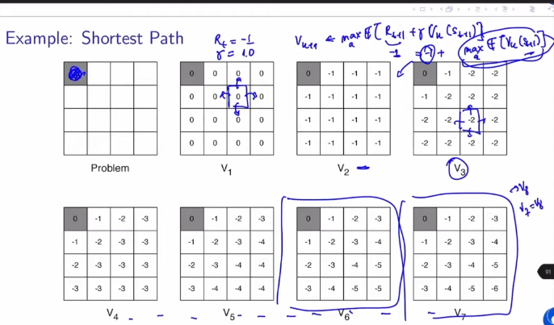

## Synchronous Dynamic Programming Algorithms

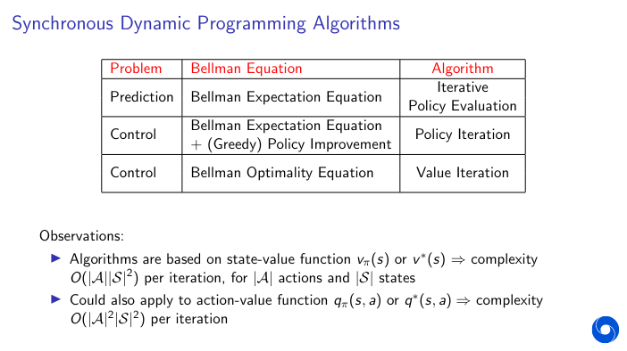

## Asynchronous Dynamic Programming

- DP methods described so far used synchronous updates (all states in parallel)
  
- Asynchronous DP
    - backs up states individually, in any order
    - can significantly reduce computation
    - guaranteed to converge if all states continue to be selected

Three simple ideas for asynchronous dynamic programming:

- In-place dynamic programming
- Prioritised sweeping
- Real-time dynamic programming

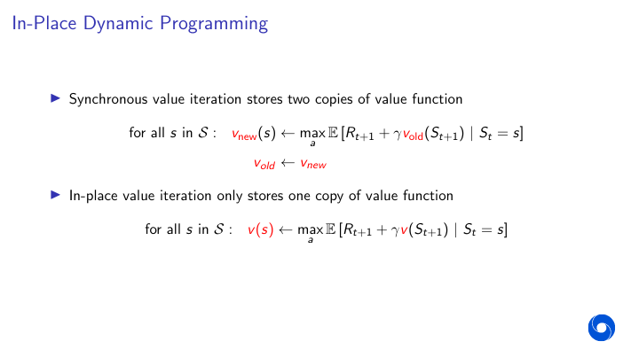

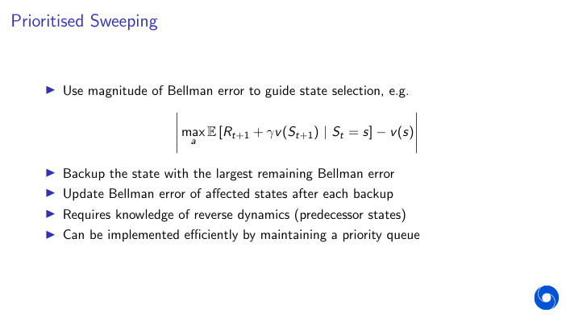

## Real Time DP

- Idea: only update states that are relevant to agent
- E.g., if the agent is in state St , update that state value, or states that it expects to be in soon

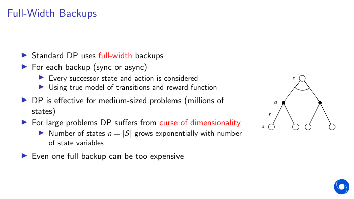

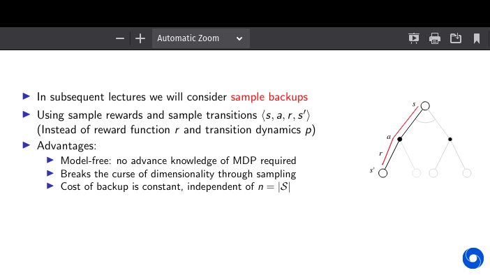

## Summary

- Markov Decision Processes
- Objectives in an MDP: different notion of return
- Value functions - expected returns, condition on state (and action)
- Optimality principles in MDPs: optimal value functions and optimal policies
- Bellman Equations
- Two class of problems in RL: evaluation and control
- How to compute vπ (aka solve an evaluation/prediction problem)
- How to compute the optimal value function via dynamic programming:
  - Policy Iteration
  - Value Iteration 

