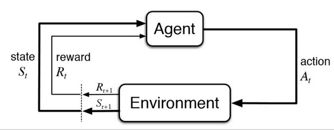
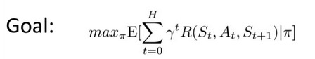
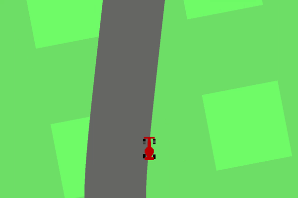
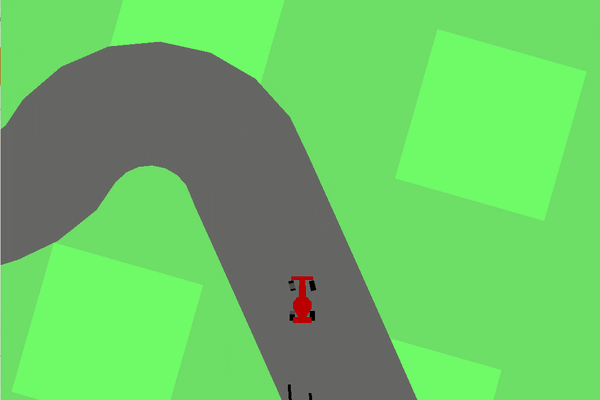
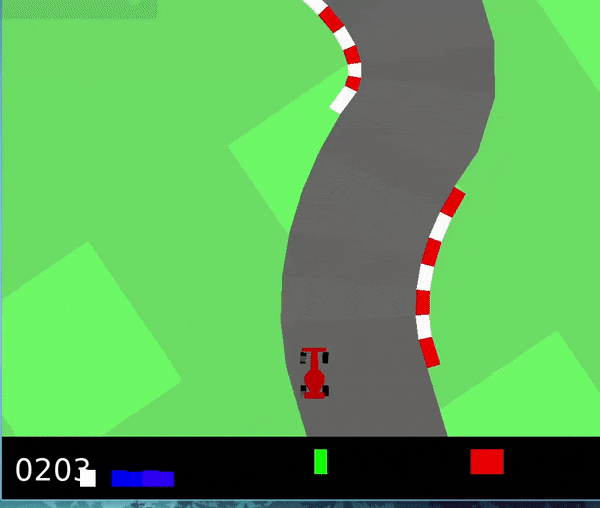

# Reinforcement Learning - Tutorial for beginners. 

## Introduction

`Try try till you succeed.` This phrase is something that you hear often. It means that no one is a failure as long as they keep trying. It also means Success does not come at first attempt. What if I tell you this phrase can also be applied in Machine learning?

This is where reinforcement learning comes into place. It is allowing machines to learn and solve problems themselves with Artificial Intelligence mostly through trial and error.

This blog features a brief introduction to the world of reinforcement learning, its framework in form of MDP along with a programming tutorial with the help of OpenAI gym in python. 

## RL in a nutshell 

- Reinforcement learning is a machine learning training method based on rewarding desired behaviors and/or punishing undesired ones. 
- In general, a reinforcement learning *agent* is able to perceive and interpret its environment, take actions and learn through trial and error.
- It is different from other ML/AI approaches by its emphasis on learning from direct interaction with its environment. 

## Some featured examples: 


- DeepMind's implementation of DQN in 2013 on seven Atari 2600 games, where the agent outperformed all the previous approaches on six of the games and could surpass a human expert on three of them  

- This year (2021), DeepMind also released [RGB_stacking](https://deepmind.com/blog/article/stacking-our-way-to-more-general-robots) and used reinforcement learning to train a robotic arc to balance and stack objects of different shapes. 

## Markov Decision Process(MDP)



This is a pretty well-known diagram of what actually happens in RL in a simplified way.

- The learner and decision maker is called the **agent**.
- The thing it interacts with, comprising everything outside the agent, is called the **environment**.
- These interact continually, the agent selecting **actions** and the environment responding to these actions and presenting **new** situations to the agent.
- The environment also gives rise to **rewards**, special numerical values that the agent seeks to **maximize** over time through its choice of actions.
- Basically, If you have a problem you want to solve, if you can map it to an MDP, it means you can run a reinforcement algorithm on it

### An MDP is defined by:

- Set of states  S
- Set of actions  A
- Transition function  P(s’ | s, a)  
- Reward function  R(s, a, s’) 
- Start state  s0
- Discount factor γ
- Horizon H
 
### To explain these terms:

- There's a set of states, then a set of actions the agent gets to choose from.
- There's a transition function that defines the probability of ending up in state S’ at the next time, given at the current time, the agent is in state s and took action a.
- There's a reward function that assigns reward for that transition when you were in a state s, took action a, landed in state s prime.
- There is a start state, and a discount factor γ that essentially captures that things that are further in the future, we might care less about.
- For eg, we care more about getting a reward today than getting a reward, let's say a year from now and so the discounting says we should discount future rewards.
- Horizon H is basically Number of Timesteps

### The end goal



- Basically this scary math equation means that the goal is to maximize the expected discounted sum of rewards accumulated over time.
- This can be achieved by finding a policy that suits our purpose.
- The easiest way to explain policy is that it is the agent’s strategy or A policy defines the learning agent's way of behaving at a given time.
- In general, the goal of any RL algorithm is to learn an optimal policy that achieves a specific goal. 
- There are two ways to solve an MDP in case of Exact Solution Methods. **Value iteration** and **Policy iteration**
- These methods can be used to solve a variety of problems, like the Multi Armed Bandit Problem, which is a dilemma of Exploration/Exploitation. 

## The fun part - OpenAI Gym

- In this project we used OpenAI Gym library to implement various Reinforcement Learning algorithms. 
- One advantage of gym is that the environments share a similar interface, meaning you could write general algorithms if needed.
- Basically The Gym is providing us the environment and we provide the algorithms to solve them.
- To get started refer the documentation [here](https://gym.openai.com/docs/)

### Which environment to start with?

- The most basic environment that everyone should complete first is the CartPole environment. More about that [here](https://gym.openai.com/envs/CartPole-v0/)
- We have solved 5 environments in OpenAI gym and this blog mainly covers one of the interesting environments, mainly the Racing Car environment.

## Racing Car

### Brief description 
- The Racing car environment is one of the more intermediate environments available in OpenAI gym.
- It is a top down racing environment. The track is randomly generated every episode.
- State consists of STATE_W x STATE_H pixels.
- The episode finishes when all the tiles are visited 
- The car also can go outside of the usable field that is far off the track and will get -100 points.
- The reward here depends on the number of tiles of tracks you have visited 
- The exact reward is :  -0.1 every frame and +1000/N for every track tile visited, where N is the total number of tiles visited in the track. For example, if you have finished in 732 frames, your reward is 1000 - 0.1*732 = 926.8 points.
- For complex environments like this, for beginners it is recommended to use stable-baselines3  

## Stable-Baselines3:
- [Stable Baselines](https://github.com/hill-a/stable-baselines) is a set of improved implementations of Reinforcement Learning (RL) algorithms based on OpenAI [Baselines](https://github.com/openai/baselines).
- We are using Stable-Baselines3 which is essentially an up to date version of stable baselines also having tensorboard support.

## The CODE 

- We are basically going to divide the process into 5 steps. And explain as we go   

## Step 1: import dependencies 

```Python
import gym 
from stable_baselines3 import PPO
from stable_baselines3.common.vec_env import VecFrameStack
from stable_baselines3.common.vec_env import DummyVecEnv
from stable_baselines3.common.evaluation import evaluate_policy
from stable_baselines3.common.env_util import make_vec_env
import os
```
- We decided to use stable baseline's implementation of PPO for this environment as it is known to give good results.
- you can use pip install command for the dependencies
> pip install gym

> pip install stable_baselines3

- To import all the dependencies use:

> `pip install gym[all]`

Note: On linux, some shells such as Zsh require quotation marks around brackets i.e.
> `pip install 'gym[all]'` 

## Why PPO? 
- PPO or Proximal Policy Optimization is an approximation to an optimization algorithm called TRPO. 
- The main idea is that in both algorithms, some optimization technique guarantees small but correct steps towards one of the answers (policies). Because it only approximates this technique we do not have a guarantee, but it works out in practice! 
- In genetic algorithms, you generate random changes and pick whichever ones happen to perform well. 
- Instead, algorithms like TRPO, PPO change your policy in a direction where there's good reason to believe it will perform well (i.e., in the direction that increases the policy objective). 
- It's not guaranteed to always be a strict improvement, but unlike genetic algorithms, which treat the optimized thing AFAIK as a black box, you treat it as a white box that you put into some informed optimizer like stochastic gradient descent.
- This approach implies that the algorithm won't spend much time trying random mutations that won't do any better.

## Step 2: Testing the environment

```Python
environment_name = "CarRacing-v0"
env = gym.make(environment_name)
episodes = 1
for episode in range(1, episodes+1):
    state = env.reset()
    done = False
    score = 0 
    
    while not done:
        env.render()
        action = env.action_space.sample()
        n_state, reward, done, info = env.step(action)
        score+=reward
    print('Episode:{} Score:{}'.format(episode, score))
env.close()
```
- This will basically run the environment by taking some random action from the action space provided to us by the environment
- We mainly do this to get more information about the environment so we know what type of situation we are dealing with.
- This is not possible in real world implementation of RL, you could think of it as training (Hence the name OpenAI "Gym" ;))

```Python
env.action_space
env.action_space.sample()
env.observation_space
env.observation_space.sample()
```
- The above block of code serves the same purpose i.e. to get to know our environment. In this case Both the action and observation space is of Box type which means that it is a continuous type of environment. 

## Step 3: Train the model

```Python
log_path = os.path.join('Training', 'Logs')
model = PPO("CnnPolicy", env, verbose=1, tensorboard_log=log_path)
model.learn(total_timesteps = 2000000)
```
- In this step we are training the Model using PPO and the policy we are using is the CNNPolicy which works really well with box type environments where graphics image is generated

## Step 4: Save model

```Python
ppo_path = os.path.join('Training', 'Saved Models''PPO_2m_Driving_model')
model.save(ppo_path)
```
- After training, we are saving the model in our Saved Models folder.
  
## Step 5: Load and evaluate model 

```Python
model_path = os.path.join('Training', 'Saved Models', 'PPO_2m_Driving_model')
model = PPO.load(model_path, env) 

evaluate_policy(model, env, n_eval_episodes = 3, return_episode_rewards = True, render = True)
```

- We load our trained model, and evaluate it in the final step.

## Results: 

- We achieved a score of around 600-700(Max of 860) after training for 4-5hrs (Note: This depends on your cpu/gpu and the algorithm/python-notebook you are using)
- We believe that training it for more timesteps and adding some hyper-parameters will give great results! 

## Some peculiar cases:


- Going backwards: Here the agent, after recovering from slipping, returns to the track but starts going in the wrong direction.


- In this the agent avoids going out of bounds by breaking and taking curve slowly.

### End Result:
- The end result looked something like this:
  


## Conclusion:

We hope this blog gave you a brief idea about Reinforcement Learning and an introduction to libraries such as OpenAI gym and stable-baselines3. 

ps: Special thanks to our mentors in SRA who helped us along the way.

## Authors

- [Himanshu Chougule](https://github.com/himanshu-02)
- [Chirag Shelar](https://github.com/ChiragShelar)
