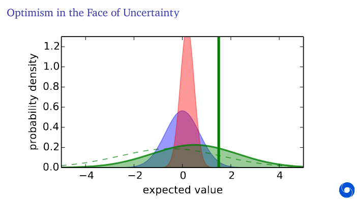
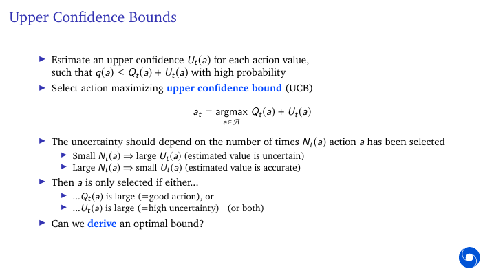

# Lecture 2

.../.../..

Multi-Armed Bandit - Think about slot machines 

---

Value and regret 

We want to minimise **total regret**

Maximise cumulative reward ≡minimise 
total regret

---

We will discuss several algorithms:

- Greedy
- ε-greedy
- UCB
- Thompson sampling
- Policy gradients
- The first three all use action value estimates Qt (a)≈q(a)

True action value is expected award

A simple estimate is average of sampled rewards

- is indication function (true or false)

---
ALgorithms:

--- 
Greedy policy

- If multiple actions have same max value you can break ties randomly.
- Think about regrets of Greedy Policy.
- It takes action based on previous knowledge and can get stuck choosing the wrong action indefinitely
- It doesn't explore enough.
- Has linear expected total regret.

---

## Episilon Greedy

- Greedy can get stuck on a suboptimal action forever i.e 
- with probability 1-E and E we choose different actions.
- Atar- game eg was trained with this algorithm
- Continues to explore
- Has constant E so has linear expected total regret. 

---

## Policy gradients

- A stochastic policy allows our agent to explore the state space without always taking the same action.
- exponential give +ve
- Gradient ascent updates policy parameters such that expected value increases.

- we need to convert gradient into sample to use it

- It is called reinforced trick or Log-likelihood trick
- LHS = Gradient of expection of reward given the policy
- RHS = Expectation of reward times the gradient of the logarithm of the policy //chain rule
- RHS is something we can sample.

- value free algorithm

For Soft max:
- Using Ht+1 actions for preference increase or decrease depending on the reward you recieve.
- Policy is stochastic 
- could get stuck at a sub-optimal policy like greedy 
- better in practice. Used in deep neural networks.

- We can get 0.5, -0.5 rewards by adding/subtracting

---

- KL divergence bounds regrets into term logarithmic in t 

- More uncertainty in value the more it needs to be explored.

## UCP

- Qa should be large enough that we are certain that mean is lower than this number and eventually converges to true mean.
- If we are very uncertain about action we will pick it
- Action will be selected if value is good or if its bound is very large i.e. we are uncertain about it
- Episilon greedy doesn't do this
- UCB stops selecting when bound is small and value is not good

### Hoeffding's Identity

- For simplicity rewards are b/w 0 and 1
- Let our bound be equal to probablity p
- we need to reduce p to observe more rewards
![calculating UCP2]
- This is basically to ensure we are choosing the correct action

## Bayesian Bandits

- We could adopt Bayesian approach and model distributions over values p(q(a) |θt )
- This is interpreted as our belief that, e.g., q(a)=x for all x ∈R
- E.g., θt could contain the means and variances of Gaussian belief distributions
- Allows us to inject rich prior knowledge θ0
- We can then use posterior belief to guide exploration

- Quanitfy our incertainty about expected reward is and update that over time as we go
- Probablity is over **expected reward** of action a or value of action a
  

- For example consider Bernoull- reward distribution 0 or +1
- For each action we think each value b/w 0to1 is equally likey

## Thompson sampling

- To solve bandits using bayesian approach

- picks an action acc to our belief that it is optimal
- If we have more uncertainty about our action, the probablity that it's value is high is more

- Simply sample the action values and pick greedy
- It is the same as trying to compute these whole probablities and then selecting your action acc to that.
- It is basically a technique that helps us go from Bayesian distributions to posterior distributions to a policy.
- It is considered optimal.

## Informative state space

- We have viewed bandits as one-step decision-making problems
- Can also view as sequential decision-making problems
- Each step the agent updates state St to summarise the past
- Each action At causes a transition to a new information stat St   +1 (by addinginformation), with probability p(St+1 | At ,St )
- We now have a Markov decision problem
- The state is fully internal to the agent
- State transitions are random due to rewards & actions
- Even in bandits actions affect the future after all, via learning

## Bayes adaptive RL
- We formulated the bandit as an infinite MDP over information states
- This can be solved by reinforcement learning
- E.g., learn a Bayesian reward distribution, plan into the future
- This is known as Bayes-adaptive RL:
optimally trades off exploration with respect to the prior distribution
- Can be extended to full RL, by also learning a transition model
- Can be unwieldy... unclear how to scale effectively

