# Lecture 4 

## Vector spaces

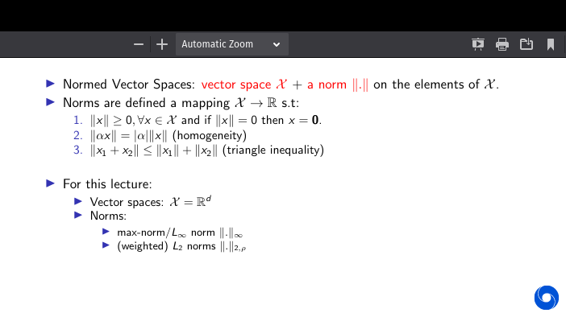

## Contraction Mapping

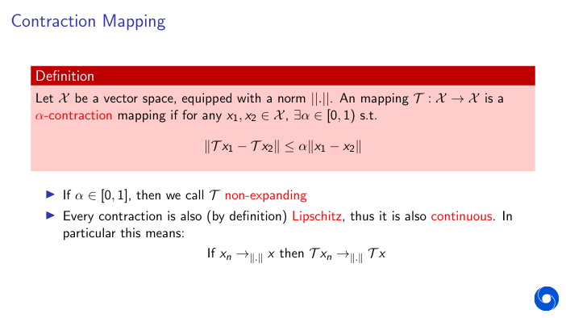
- if you apply contraction apply b/w 2 points the distance will shrink by some value A (alpha)

## Fixed point

A point/vector x ∈X is a fixed point of an operator T if Tx = x .

## Banach Fixed Point Theorem

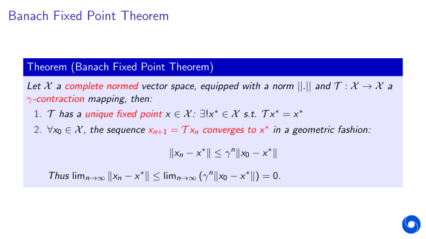

- Any cauchy sequence will converge to x
- Distance shrinks with Gamma^n rate

## Recap

- we use 2nd deffinition of MDP

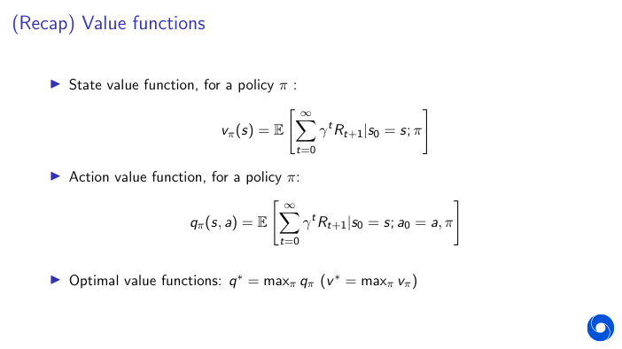

## Bellman operator

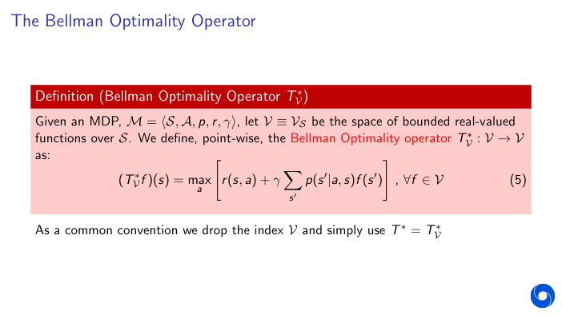

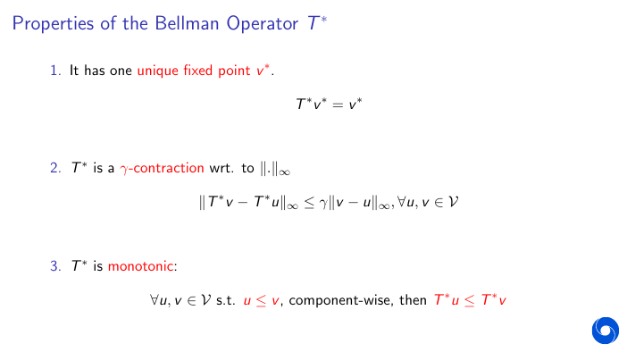

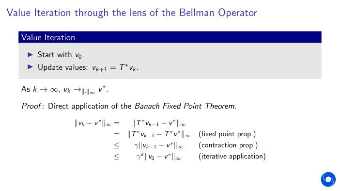

- The importance of bellman operator is that we can describe value of a state with an iterative approach

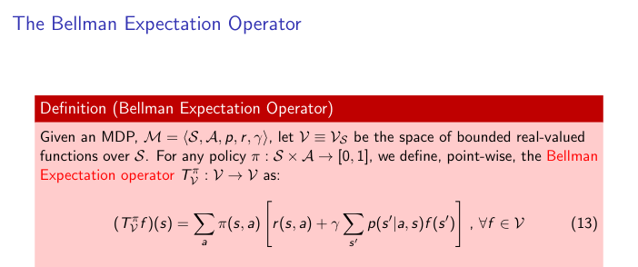

### Bellman extraction operator

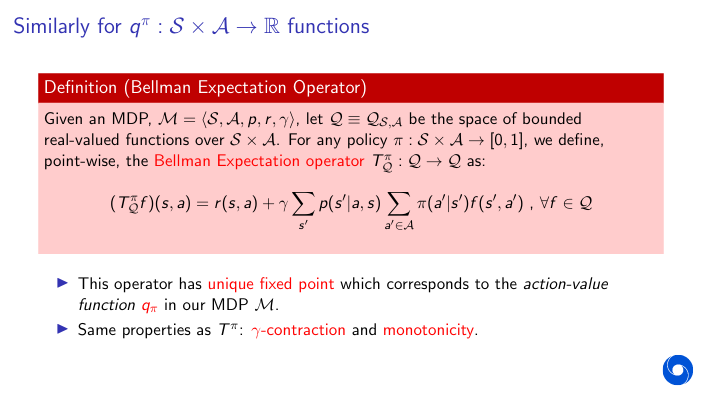

### Bellman optimality operator

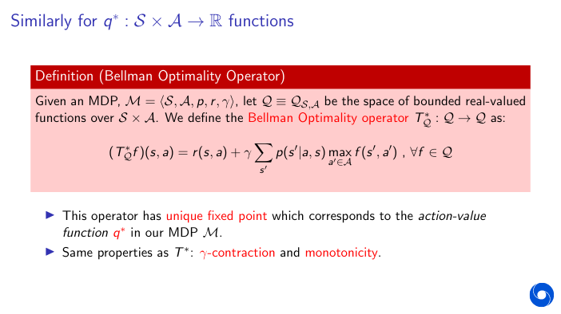

## Approximate Dynamic Programming 

- So far, we have assume perfect knowledge of the MDP and perfect/exact
representation of the value functions.

- Realistically, more often than not:
    - We won’t know the underlying MDP (like in the next two lectures)
      - sampling/estimation error, as we don’t have access to the true operators T π (T ∗)
    - We won’t be able to represent the value function exactly after each update (lectures to come)
      - approximation error, as we approximate the true value functions within a
(parametric) class (e.g. linear functions, neural nets, etc).

- Objective: Under the above conditions, come up with a policy π that is (close to)
optimal.

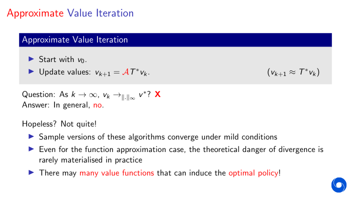
- A is approximation
- T* is true MDP
- Sample versions of these algorithms converge under mild conditions
- Even for the function approximation case, the theoretical danger of divergence is
rarely materialised in practice
- There may many value functions that can induce the optimal policy!

## Performance of a Greedy Policy

- how far this policy is from the optimal value function in terms of how good the approximation q is that you started with is
-  the approximation that you're using for the optimal value function is very close to the optimal value function then this would be a small factor so this would upper bound by a small quantity the quality of the greedy policy induced by this estimate  

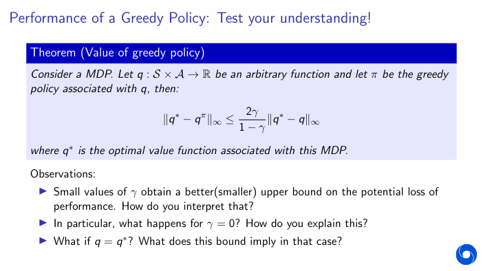

## Approximate Policy Iteration

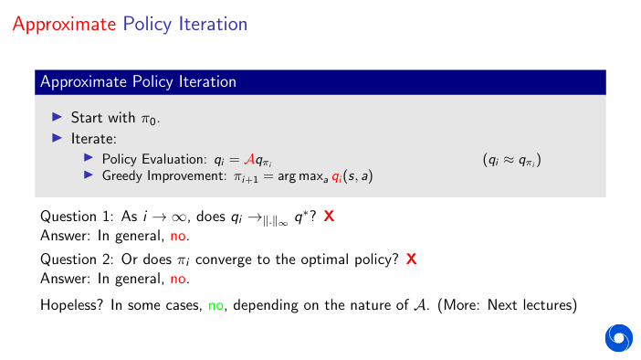

 

