# Lecture 5

## Monte Carlo Algorithms

- We can use experience samples to learn without a model
- We call direct sampling of episodes Monte Carlo
- MC is model-free: no knowledge of MDP required, only samples

### Monte carlo Bandits

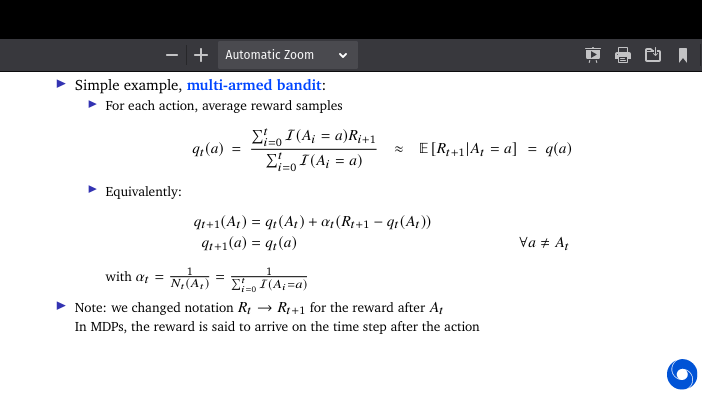

Any method which solves a problem by generating suitable random numbers, 
and observing that fraction of numbers obeying some property or properties, can be classified as a Monte Carlo method.

The Monte Carlo method for reinforcement learning learns directly from episodes of experience without any prior knowledge of MDP transitions.
Here, the random component is the return or reward.

Consider bandits with different states
- episodes are still one step
- actions do not affect state transitions
- =⇒ no long-term consequences
- Then, we want to estimate q(s, a)=E [Rt+1|St =s, At =a]
- These are called contextual bandits

## Value function approximation

- So far we mostly considered lookup tables
  - Every state s has an entry v(s)
  - Or every state-action pair s, a has an entry q(s, a)
- Problem with large MDPs:
  - There are too many states and/or actions to store in memory
  - It is too slow to learn the value of each state individually
  - Individual states are often not fully observable

Solution for large MDPs:
- Estimate value function with function approximation
    - vw(s)≈vπ(s) 
    - qw(s, a)≈qπ(s, a) 
- Update parameter w (e.g., using MC or TD learning)
- Generalise from to unseen states

## Agent state updates

- will learn in next lectures
- assume we have a good state update function

## Feature vectors

- Special usecase is linear functions
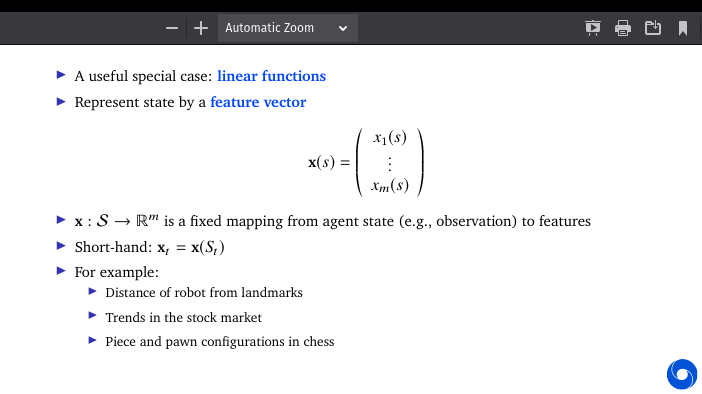

## Function approximation related 

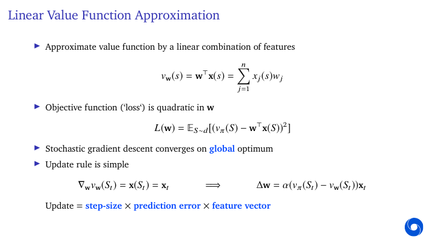

- more info in coming lectures.

## Monte carlo Algorithms

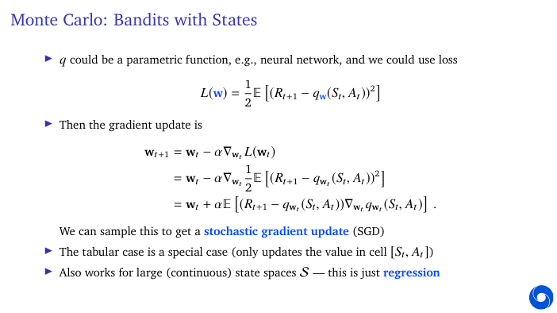

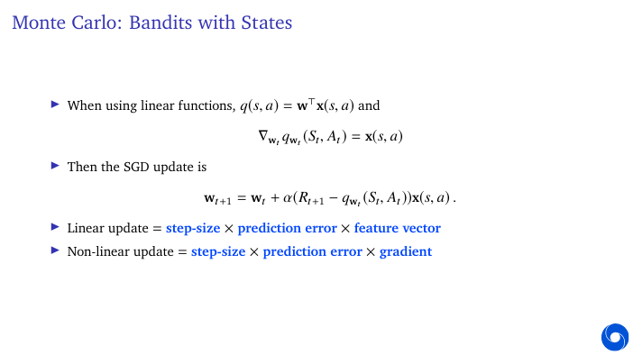

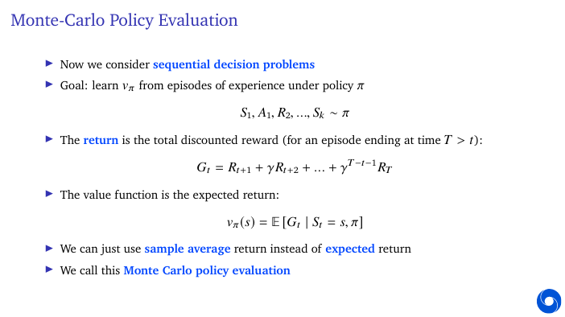

## Disadvantages of Monte-Carlo Learning

- We have seen MC algorithms can be used to learn value predictions
- But when episodes are long, learning can be slow
  - ...we have to wait until an episode ends before we can learn
  - ...return can have high variance

## Temporal Difference Learning

Temporal difference (TD) learning is an approach to learning how to predict a quantity that depends on future values of a given signal. 

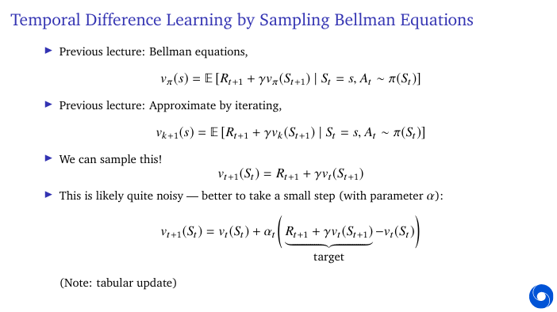

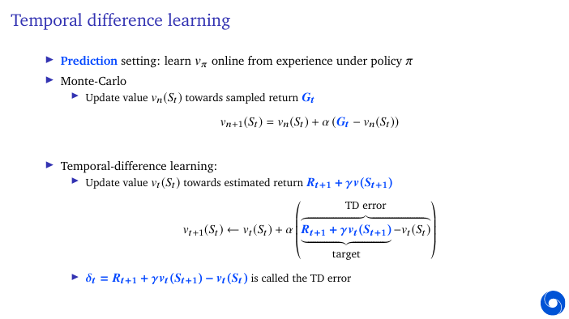

## Bootstrapping and Sampling

- Bootstrapping: update involves an estimate
  - MC does not bootstrap
  - DP bootstraps
  - TD bootstraps
- Sampling: update samples an expectation
  - MC samples
  - DP does not sample
  - TD samples

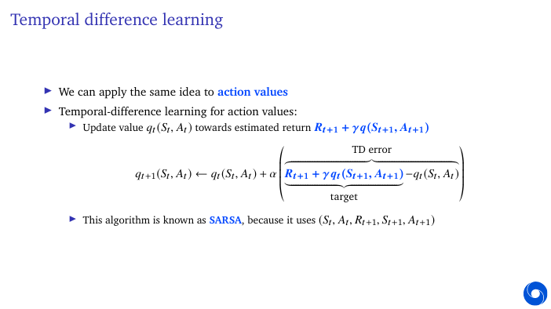

## Advantages and Disadvantages of MC vs TD

- TD can learn before knowing the final outcome
  - TD can learn online after every step
  - MC must wait until end of episode before return is known
- TD can learn without the final outcome
  - TD can learn from incomplete sequences
  - MC can only learn from complete sequences
  - TD works in continuing (non-terminating) environments
  - MC only works for episodic (terminating) environments
- TD is independent of the temporal span of the prediction
  - TD can learn from single transitions
  - MC must store all predictions (or states) to update at the end of an episode
- TD needs reasonable value estimates

- TD exploits Markov property
  - Can help in fully-observable environments
- MC does not exploit Markov property
  - Can help in partially-observable environments
- With finite data, or with function approximation, the solutions may differ

## Between MC and TD: Multi-Step TD

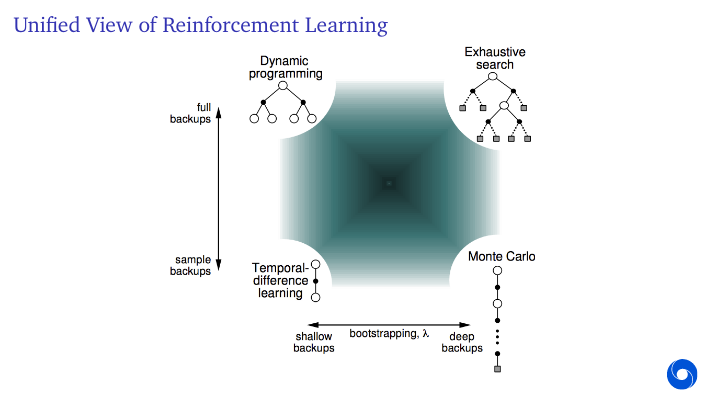

- TD uses value estimates which might be inaccurate
- In addition, information can propagate back quite slowly
- In MC information propagates faster, but the updates are noisier
- We can go in between TD and MC

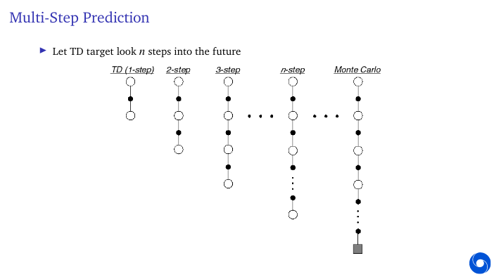

## Mult- step returns

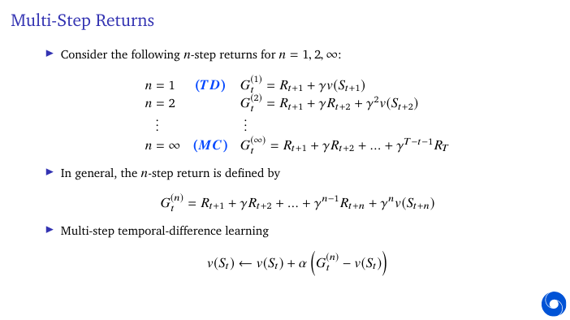

## Mixed mult- - step returns

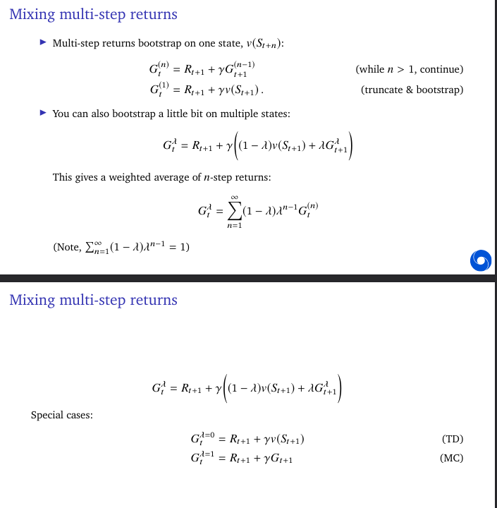

## Benefits of multi-step returns

- Multi-step returns have benefits from both TD and MC
- Bootstrapping can have issues with bias
- Monte Carlo can have issues with variance
- Typically, intermediate values of n or λ are good (e.g., n =10, λ=0.9)

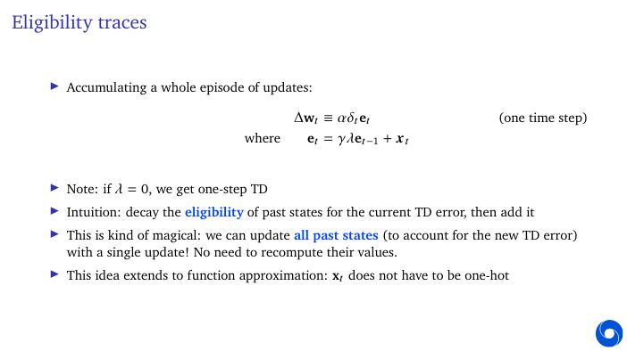

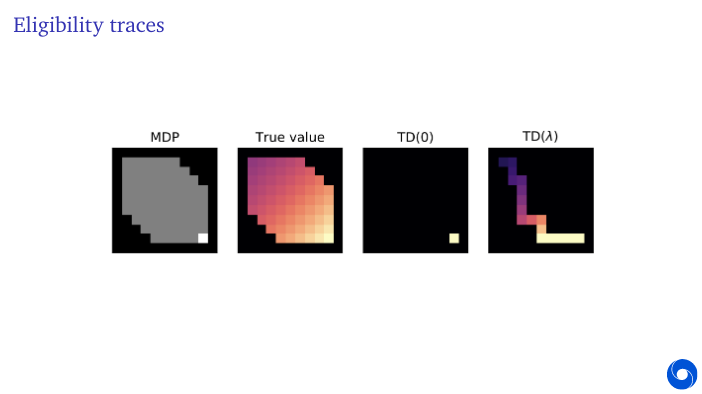

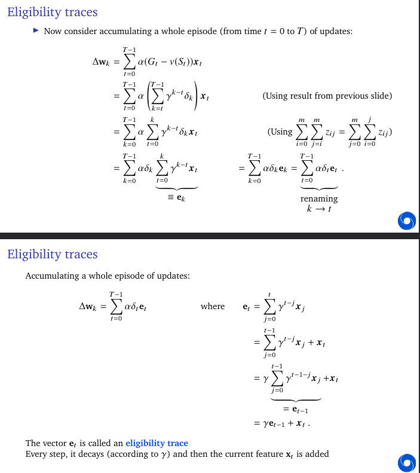

- Intuition: the same TD error shows up in multiple MC errors—grouping them allows applying it to all past states in one update.

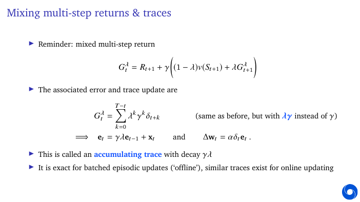

  
