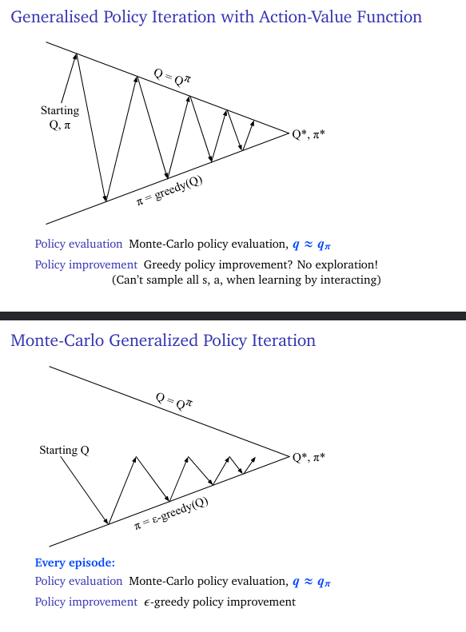
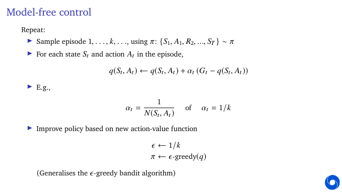
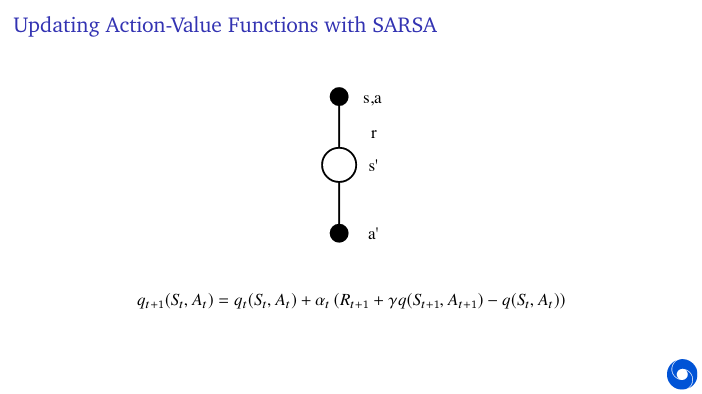
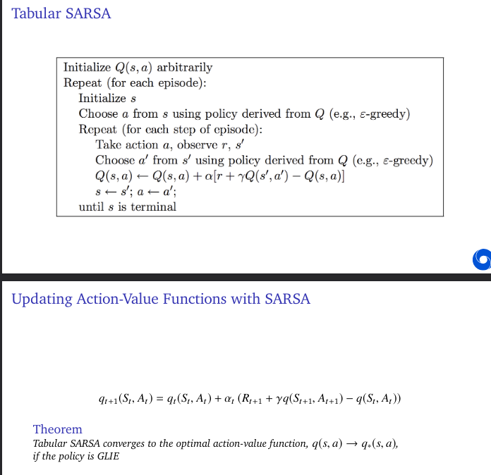
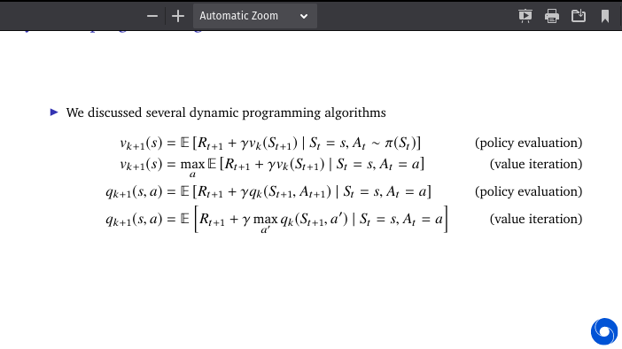
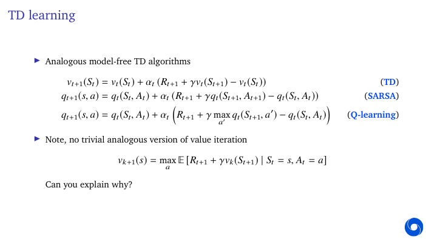
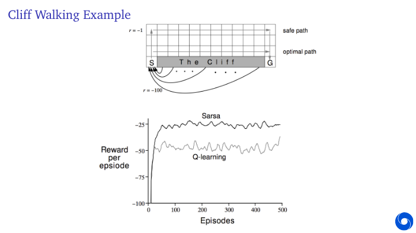
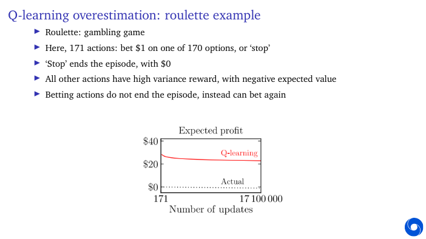

# Monte-Carlo Control

- Previous lecture: **Model-free prediction**
**Estimate** the value function of an unknown MDP
- This lecture: **Model-free control**
**Optimise** the value function of an unknown MDP

- Theorem
GLIE Model-free control converges to the optimal action-value function, qt →q∗

## MC vs. TD Control

- Temporal-difference (TD) learning has several advantages over Monte-Carlo (MC)
  - Lower variance
  - Online
  - Can learn from incomplete sequences
- Natural idea: use TD instead of MC for control
  - Apply TD to q(s, a)
  - Use, e.g., -greedy policy improvement
  - Update every time-step

## Off-policy TD and Q-learning

On policy learning 
- learn about behaviour policy π from experience sampled from π

Off policy learning
- Learn about target policy π from experience sampled from μ
- Learn ‘counterfactually’ about other things you could do: “what if...?”
- E.g., “What if - would turn left?” =⇒ new observations, rewards?
- E.g., “What if - would play more defensively?” =⇒ different win probability?
- E.g., “What if - would continue to go forward?” =⇒ how long until - bump into a wall?

## Q-Learning Control Algorithm

Q-learning control converges to the optimal action-value function, q →q∗, as long as we take
each action in each state infinitely often.

Note: no need for greedy behaviour!

Works for any policy that eventually selects all actions sufficiently often
(Requires appropriately decaying step sizes Õt αt =∞, Õt α2t < ∞,
E.g., α =1/tω, with ω ∈(0.5,1))

## Q-learning overestimation

- Classical Q-learning has potential issues
- Recall
maxa qt (St+1, a) =qt (St+1,argmaxa
qt (St+1, a))
- Uses same values to **select** and to **evaluate**
- ... but values are approximate
  - **more** likely to select **overestimated** values
  - **less** likely to select **underestimated** values
- This causes upward bias

### Example Roulette

![Q overestimation]

## Double DQN

![Double Q ss taken]

![DQN vs atari]

Double learning

- The idea of double Q-learning can be generalised to other updates
  - E.g., if you are (soft-) greedy (e.g., -greedy), then SARSA can also overestimate
  - The same solution can be used
  - =⇒ double SARSA
  
## Off policy learning

- Recall: off-policy learning means learning about one policy π from experience generated
according to a different policy μ
- Q-learning is one example, but there are other options
- Fortunately, there are general tools to help with this
- Caveat: you can’t expect to learn about things you **never** do

![Importance ss taken]

## Expected SARSA

![Expected SARSA]

## Model-Free Policy Iteration

- We can learn action values to predict the current policy π
- Then we can do policy improvement, e.g., make the policy greedy π →π′
- Q-learning is akin to value iteration: immediately estimate the **current greedy policy**
- (Expected) SARSA can be used more similar to policy iteration:
evaluate current behaviour, then (immediately) update behaviour
- Sometimes we want to estimate some different policy: this is off-policy learning
- Learning about the greedy policy is a special case of off-policy learning

![Q Learning SARSA ss taken]

## Brief summary

- Q-learning uses a **greedy** target policy
- SARSA uses a **stochastic sample from the behaviour** as target policy
- Expected SARSA uses **any** target policy
- Double learning uses a **separate value function** to evaluate the policy (for any policy)
- Double learning is not necessary as there is **no correlation** between target policy and value function (e.g., pure prediction)
- When using a **greedy policy** (Q-learning), there are strong correlations. Then double learning (Double Q-learning) can be useful