# Planning and Models

## Model 
Model-Based RL:
- Learn a model from experience
- Plan value functions using the learned model

One clear disadvantage:
- First learn a model, then construct a value function
    - two sources of approximation error
- Learn a value function directly
    - only one source of approximation error
However:
- Models can efficiently be learned by supervised learning methods
- Reason about model uncertainty (better exploration)
- Reduce the interactions in the real world (data efficiency faster/cheaper)

## Model Learning 

## Different types of models

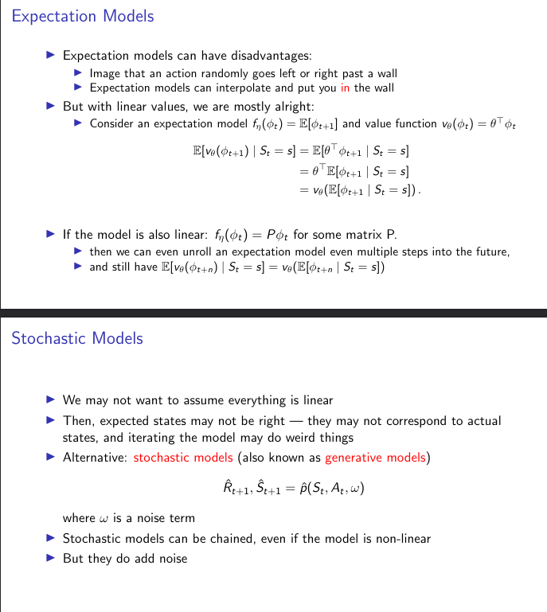
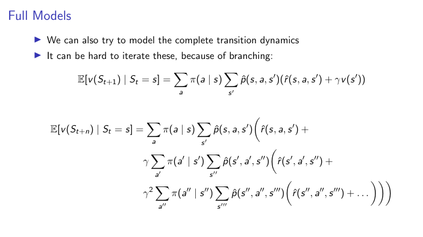

## Different examples of models

We typically decompose the dynamics pηinto separate parametric functions
- for transition and reward dynamics
For each of these we can then consider different options:
- Table Lookup Model (Model is and explicit MDP)
- Linear Expectation Model 
- Deep Neural Network Model

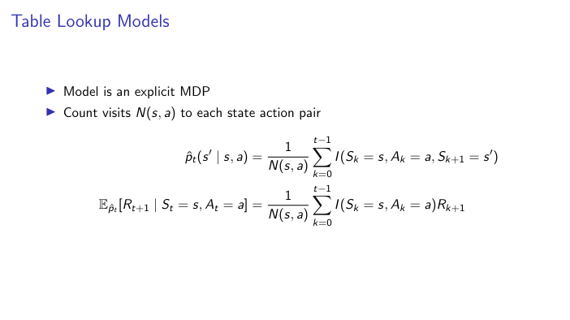

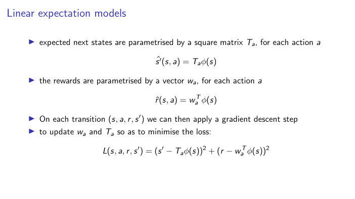

In linear expectation models
- we assume some feature representation φ is given
- so that we can encode any state s as φ(s )
- we then parametrise separately rewards and transitions
- each as a linear function of the features

## Planning

In this section we investigate planning
- This concept means different things to different communities
- For us planning is the process of investing compute to improve values and policies
- Without the need to interact with the environment
- Dynamic programming is the best example we have seen so far
- We are interested in planning algorithms that don’t require privileged access to a
perfect specification of the environment
- Instead, the planning algorithms we discuss today use learned models

- In DP in case of learned model we will solve the MDP and then use value or policy iteration. 

- We can do Sample based Planning i.e. apply Model free RL (Monte Carlo control, SARSA, Q learning) on sample experience from model 

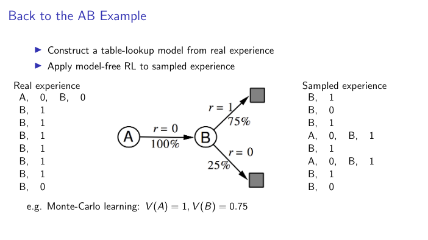

## Limits of planning with inaccurate Model

Given an imperfect model ˆpη6= p:
- The planning process may compute a suboptimal policy
- Performance is limited to optimal policy for approximate MDP 〈S,A, ˆpη〉
- Model-based RL is only as good as the estimated model

How can we deal with the inevitable inaccuracies of a learned model?
- Approach 1: when model is wrong, use model-free RL
- Approach 2: reason about model uncertainty over η (e.g. Bayesian methods)
- Approach 3: Combine model-based and model-free methods in a single algorithm

## Real and simulated experience

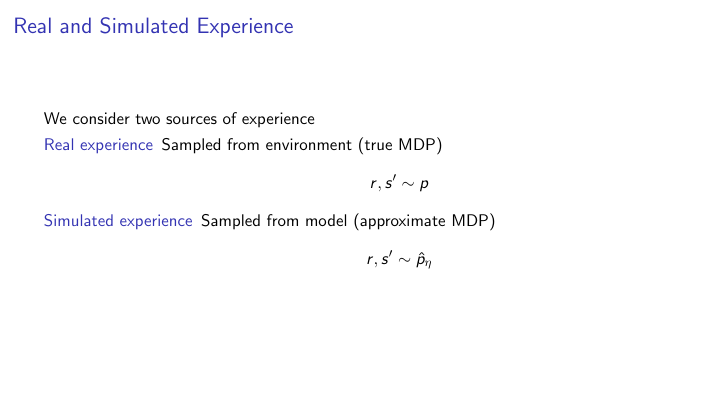

## Integrating learning and planning

- Model-Free RL
  - No model
  - Learn value function (and/or policy) from real experience
- Model-Based RL (using Sample-Based Planning)
- Learn a model from real experience
  - Plan value function (and/or policy) from simulated experience
- Dyna
  - Learn a model from real experience
  - Learn AND plan value function (and/or policy) from real and simulated experience
  - Treat real and simulated experience equivalently. Conceptually, the updates from
    learning or planning are not distinguished

## DYNA

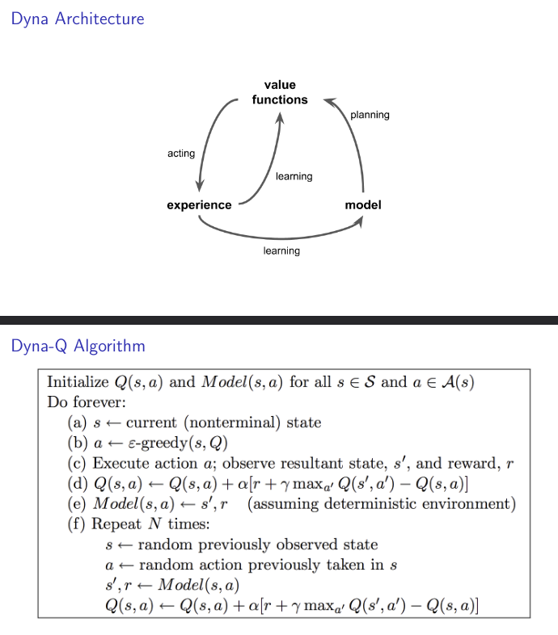

### Example 

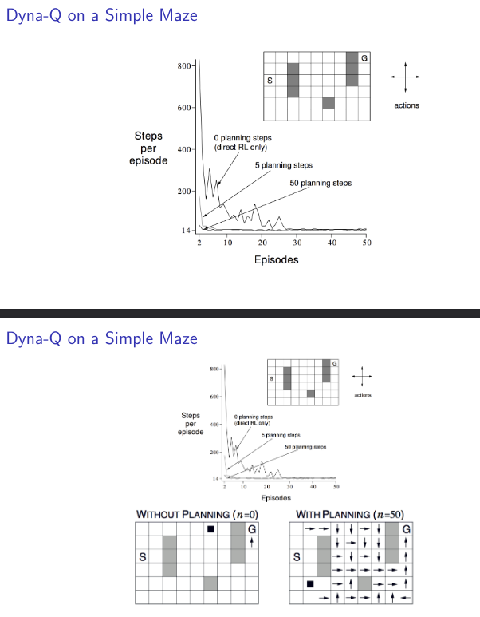

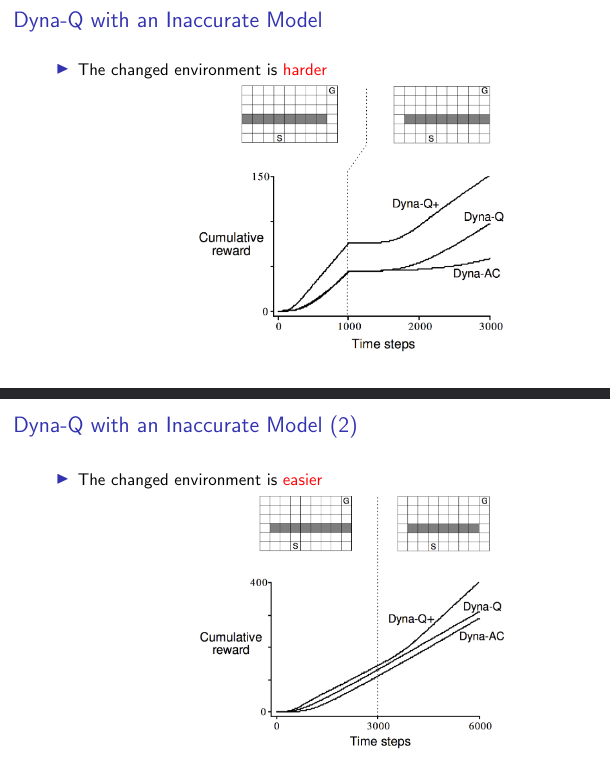

## Scalability

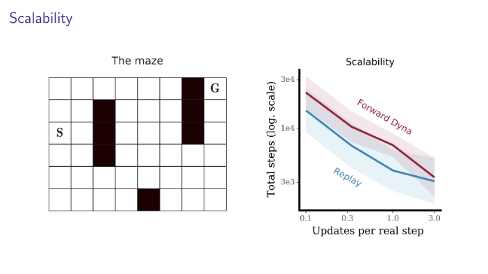

- For tabular RL there is an exact output equivalence between some conventional
model-based and model free algorithms.
- If the model is perfect, it will give the same output as a non-parametric replay
system for every (s ,a) pair
- In practice, the model is not perfect, so there will be differences
- Could model inaccuracies lead to better learning?
- Unlikely if we only use the model to sample imagined transitions from the actual
past state-action pairs.
- But a parametric model is more flexible than a replay buffer
- Plan for action-selection!
  - query a model for action that you *could* take in the future
- Counterfactual planning.
  - query a model for action that you *could* have taken in the past, but did not
- Backwards planning
  - model the inverse dynamics and assign credit to different states that *could* have
    led to a certain outcome
- Jumpy planning for long-term credit assignment,
  - plan at different timescales
Computation:
- Querying a replay buffer is very cheap!
- Generating a sample from a learned model can be very expensive
- E.g. if the model is large neural network based generative model.
Memory:
- The memory requirements of a replay buffer scale linearly with its capacity
- A parametric model can achieve goods accuracy with a fixed and comparably
small memory footprint

## Forward search and simulation-based search

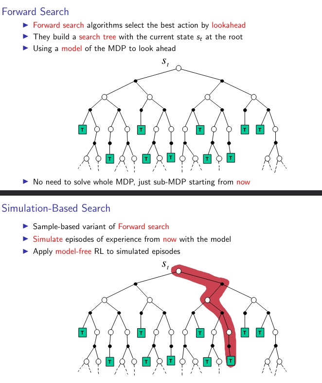

## Prediaction and Control via MC simulation

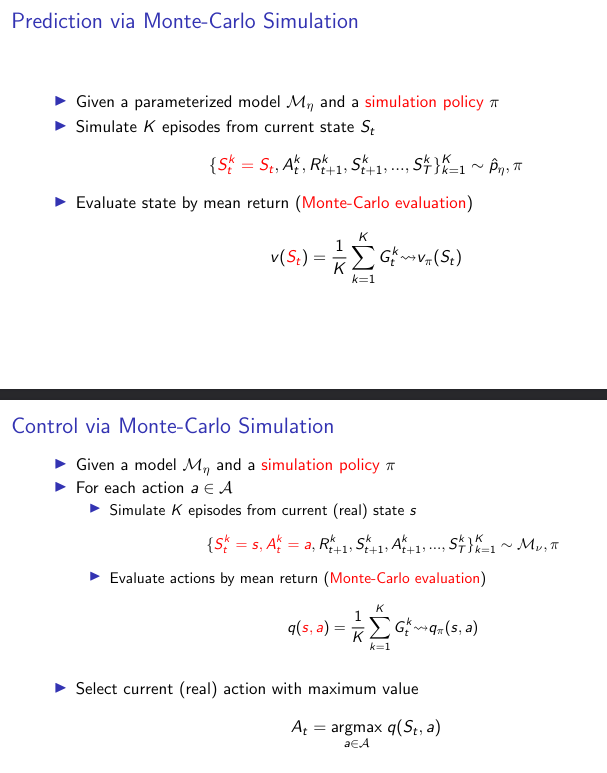

## Monte carlo Tree search

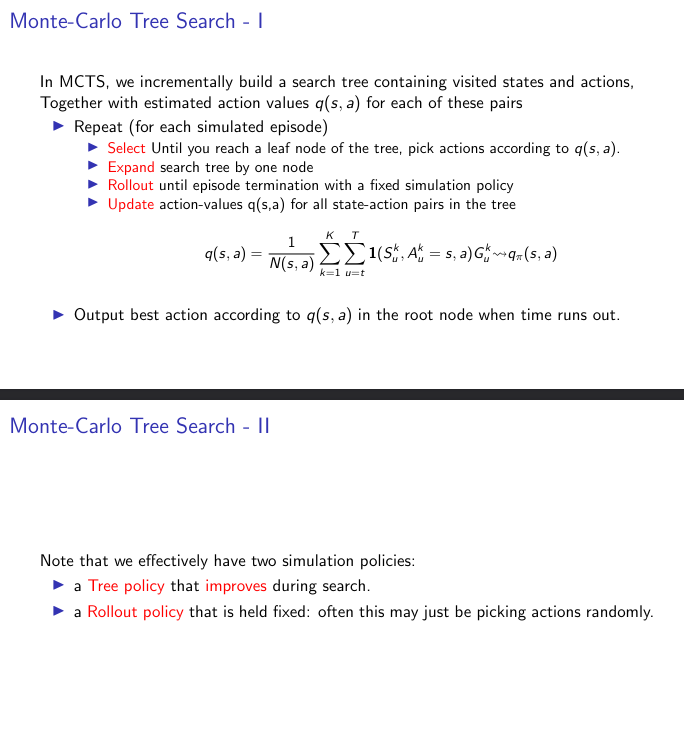

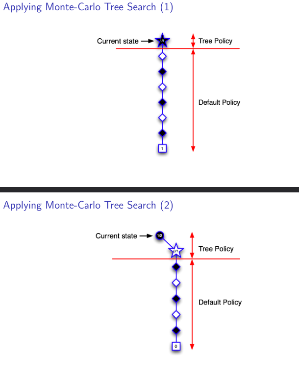

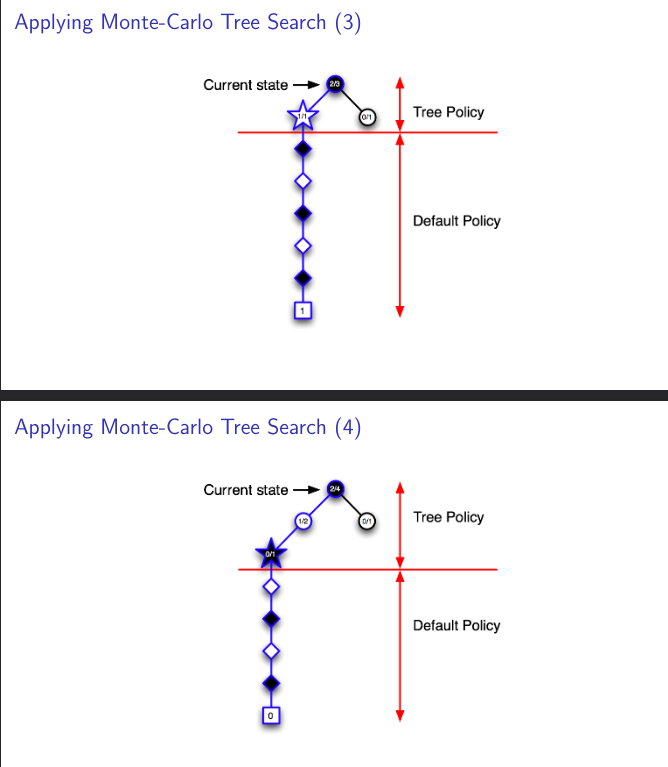

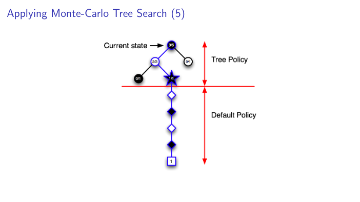

## Advantages of MC tree search

- Highly selective best-first search
- Evaluates states dynamically (unlike e.g. DP)
- Uses sampling to break curse of dimensionality
- Works for “black-box” models (only requires samples)
- Computationally efficient, anytime, parallelisable

## Search tree and Value function approximation 

- Search tree is a table lookup approach
- Based on a **partial** instantiation of the table
- For model-free reinforcement learning, table lookup is naive
  - Can’t store value for all states
  - Doesn’t generalise between similar states
- For simulation-based search, table lookup is less naive
  - Search tree stores value for easily reachable states
  - But still doesn’t generalise between similar states
  - In huge search spaces, value function approximation is helpful

