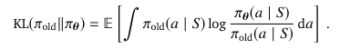

# Policy Gradients And Actor Critics

## Policy based RL

- Previously we approximated paramateric value functions
vw(s)≈vπ(s)
qw(s, a)≈qπ(s, a)
- A policy can be generated from these values (e.g., greedy)
- In this lecture we directly parametrise the policy directly
πθ(a|s)=p(a|s, θ)
- This lecture, we focus on model-free reinforcement learning

Advantages:
- True objective
- Easy extended to **high-dimensional** or **continuous** action spaces
- Can learn **stochastic** policies
- Sometimes policies are **simple** while values and models are complex
  - E.g., complicated dynamics, but optimal policy is always “move forward”
Disadvantages:
- Could get stuck in local optima
- Obtained knowledge can be **specific**, does not always generalise well
- Does not necessarily extract all useful information from the data
(when used in isolation

Why could we need stochastic policies?
- In MDPs, there is always an optimal deterministic policy
- But, most problems are not fully observable
  - This is the common case, especially with function approximation
  - The optimal policy may then be stochastic
- Search space is smoother for stochastic policies =⇒ we can use gradients
- Provides some ‘exploration’ during learning

## Policy Objective Functions

- In episodic environments we can use the **average total return per episode**
- In continuing environments we can use the **average reward per step**

## Policy Optimisation
- Policy based reinforcement learning is an **optimization** problem
- Find θ that maximises J(θ)
- We will focus on **stochastic gradient ascent**, which is often quite efficient
    (and easy to use with deep nets)
- Some approaches do not use gradient
  - Hill climbing / simulated annealing
  - Genetic algorithms / evolutionary strategies

## Policy Gradient

- This is something we can sample
- Our stochastic policy-gradient update is then

    

- In expectation, this is the following the actual gradient
- So this is a pure (unbiased) stochastic gradient algorithm
- Intuition: increase probability for actions with high rewards

## Reduce variance

## Policy Gradient Theorem

- The policy gradient approach also applies to (multi-step) MDPs
- Replaces reward R with long-term return Gt or value qπ(s, a)
- There are actually two policy gradient theorems (Sutton et al., 2000):
    **average return per episode** & **average reward per step**
- Policy gradients do not need to know the MDP dynamics

## Algorithm 

## Reduce Variance

## Critics

- A critic is a value function, learnt via **policy evaluation**:
What is the value vπθof policy πθ for current parameters θ?
- This problem was explored in previous lectures, e.g.
  - Monte-Carlo policy evaluation
  - Temporal-Difference learning
  - n-step TD

## Actor critic

### increase robustness with trust regions

- One way to increase stability is to **regularise**
- A popular method is to **limit the difference between subsequent policies**
- For instance, use the Kullbeck-Leibler divergence:

    

    (Expectation is over states)
- A divergence is like a distance between distributions
- Then maximise J(θ)−ηKL(πold‖πθ), for some hyperparameter η

## Continuous action spaces

- Pure value-based RL can be non-trivial to extend to **continuous action spaces**
  - How to approximate q(s, a)?
  - How to compute maxa q(s, a)?
- When directly updating the policy parameters, continuous actions are easier
- Most algorithms discussed today can be used for discrete and continuous actions
- Note: exploration in high-dimensional continuous spaces can be challenging

## Gradient ascent on value

- Policy gradients work well, but do not strongly exploit the critic
- If values generalise well, perhaps we can rely on them more?
  1. Estimate qw≈qπ, e.g., with Sarsa
  2. Define **deterministic actor:** At =πθ(St )
  3. Improve actor (**policy improvement**) by **gradient ascent on the value:**

    

- Known under various names:
    “Action-dependent heuristic dynamic programming” (ADHDP; Werbos 1990, Prokhorov & Wunsch 1997)
    “Gradient ascent on the value” (van Hasselt & Wiering 2007)
    These days, mostly know as: “**Deterministic policy gradient**” (DPG; Silver et al. 2014)
- It’s a form of **policy iteration**

  